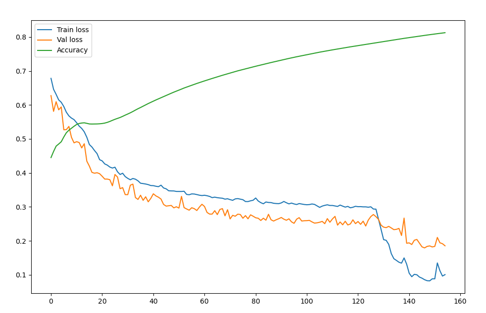
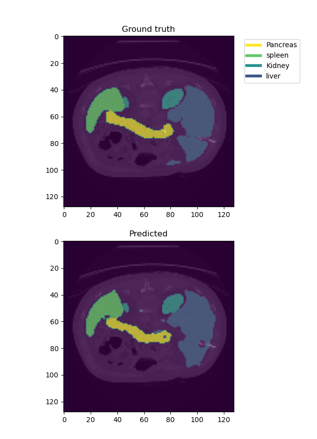
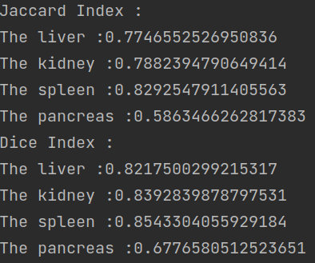

# CT scan organ detection

---------------------------------
### Generate the folder structure

---------------------------------

Ensure the following structure of the data folder is respected, optionally run bash file to generate the folders **generate_data_folder.sh**
This structure should be maintained all over the upcoming commands, otherwise, compilation errors will occur. 
#### *Data Folder structure*

---------------------------------
```text
/INFO-H410-Project 
 /data  
    /dataset  
        /images  
        /masks  
    /generated_models  
    /preprocessed_data  
        /all
        /test_set
        /training_set
        /validation_set
``` 
### Data preparation

---------------------------------
The process to prepare the data for the training is as follows : 

- The data is loaded from https://flare.grand-challenge.org/Data/.
- As the data is 3D; it is initially preprocessed (resized, normalized ..etc),
  then, the slices are extracted and loaded into **/preprocessed_data/all**. 
- The Data read from **/preprocessed_data/all** and divide it into  *Training*,*Validation* and *Test* set 

*Note: the size of the generated data can be modified in **source/config**,to preserve GPU memory the images are fixed to 128 x 128*

The above can be accomplished by running the following command  : 
```
poetry run python main.py --preprocess
```
### Train the model 

---------------------------------
The file  **source/config.py** contains all the parameters and hyperparameters that allow modifying the model for instance the learning rate, the mini batch size ...etc
```
poetry run python main.p --train
```
Note that the model is saved to **/generated_models** after every epoch. One epoch corresponds to when the model has looped through all the training data. In the same folder **metrics.csv** file is updated after every epoch that 
summarises the model performance throughout the epochs, and it contains: 
- the epoch number
- The training loss, note that the multiclass dice score is used as a loss function
- The validation loss 
- The accuracy. Jaccard index is used as an accuracy metric

### Show the training evolution 

---------------------------------
To display the model evolution during the training, **/generated_models/metrics.csv** that has been generated previously is used. 
Run the following command : 
```
poetry run python main.py --show-evol
```
For example, the following will be display 

### Perform a prediction

---------------------------------
To perform a prediction and display it on given test data, run the following command

```
poetry run python main.py --predict [image_name]
```
ensure that **[image_name]**  is from **/preprocessed_data/test_set**
else it won't work. 

A CT Scan image with comparison of the segmentation in between the ground Truth and the prediction 

 
An example command :
```
poetry run python main.py --predict image3707
```
No image extension or segmentation is added, use only the image name 

### Get the model performance

---------------------------------
Finally, it is important to get the overall model performance. Jaccard and dice index are used 
to measure the overall model performance. As we are dealing with multiclass segmentation, the metrics are displayed per class.  

```
poetry run python main.py ----performance
```
The following will be displayed in the command line :


---------------------------------

#### Warning 
Ensure that the python version used is >=3.7 else installation issue will arise with poetry 